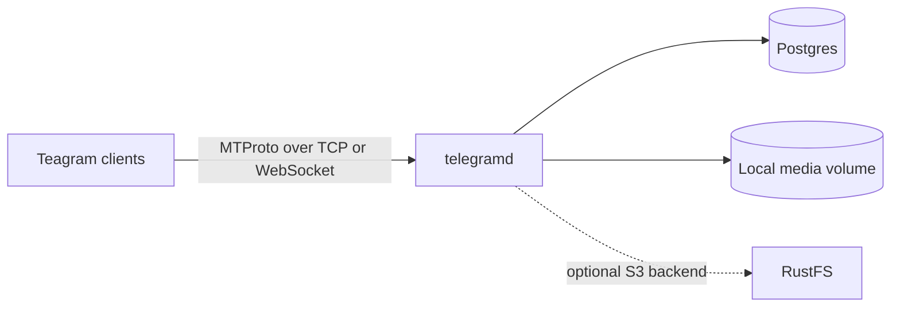

<picture>
  <source media="(prefers-color-scheme: dark)" srcset="docs/assets/banner-dark.svg">
  <source media="(prefers-color-scheme: light)" srcset="docs/assets/banner-light.svg">
  
</picture>

# Teagram Server

Teagram Server is a Go MTProto server for Teagram clients, with Postgres-backed
accounts and messages, local media storage, and an admin metrics dashboard. The
live deployment is for development and has no real users. Teagram is an
independent project and is not affiliated with Telegram.

[](https://github.com/teagramhq/teagram-server/actions/workflows/ci.yml)

Required checks on `main`: `ci`, `docker`, `compose`, `sqlc`, `pr-title`, `smoke`, `e2e-admin`, and `lint`.

## Features

- Username and password sign-in using SRP, with closed, invite, or open registration.
- Direct messages, group chats, channels, and supergroups, with history, read state, updates, and invites.
- Photo and document uploads and messages, polls, reactions, search, dialog filters, cloud drafts, and unread marks.
- Local media storage, optional RustFS/S3 support, and a read-only admin dashboard.

### Known deployment issues

- On live target `777742c`, recipients cannot open received photos or documents (MAIN-1548; [open fix PR #540](https://github.com/teagramhq/teagram-server/pull/540)).
- On `777742c`, channel dialogs with unread posts opened empty; this was fixed on `main` (MAIN-1503; [PR #522](https://github.com/teagramhq/teagram-server/pull/522)).

## Sign-in

Accounts use a username and password. Phone login is out of scope. Teagram
clients do not sign in by phone or QR.

## Local development with Compose

The live development stack uses a runner-pinned Compose artifact with a local
media volume. Initialize and start it through the [rollout runner guide](deploy/telegramd/rollout-runner/README.md); a fresh `docker compose up` is blocked until the runner publishes the required blob-mode authority. The checked-in default Compose file selects the RustFS/S3 path and is not the live deployment. Do not create blob-mode authority by hand.

For a local Go build and run, start Postgres, set `TG_POSTGRES_DSN`, and provide
a server RSA identity and auth-key master key. Apply the Atlas migrations before
starting the server:

```sh
make migrate
make build
make run
```

On a fresh database, registration is closed by default. Temporarily set
`TG_REGISTRATION=open` to create the first account, then close registration
again.

## Configuration

Configuration is read from environment variables. The full reference is in [docs/clients.md](docs/clients.md).

| Variable | Default | Purpose |
|---|---|---|
| `TG_POSTGRES_DSN` | required | Postgres connection string |
| `TG_AUTHKEY_ENC_KEY` or `TG_AUTHKEY_ENC_KEY_FILE` | required | AES-256-GCM master key for stored auth keys |
| `TG_LISTEN_ADDR` | `:2443` | MTProto listener address |
| `TG_WEBSOCKET_LISTEN_ADDR` | unset | Optional WebSocket MTProto listener |
| `TG_ADVERTISE_ADDR` | derived | Public `host:port` advertised to clients |
| `TG_PUBLIC_LINK_PREFIX` | required | HTTPS origin for client and invite links |
| `TG_RSA_KEY_PATH` | `server_key.pem` | Existing server RSA identity |
| `TG_REGISTRATION` | `closed` | `closed`, `invite`, or `open` account registration |
| `TG_BLOB_DIR` | `blobs` | Local media directory |
| `TG_BLOB_S3_ENDPOINT` | unset | Enables the optional S3-compatible backend with the other `TG_BLOB_S3_*` settings |
| `TG_RPC_DEADLINE` | `23s` | Per-request timeout; must be positive and at most `45s` |
| `TG_STATEMENT_TIMEOUT` | `17s` | Per-Postgres-statement timeout; `0` disables it |
| `TG_MAX_PREAUTH_CONNS` | `1024` | Deployment-wide cap on unauthenticated connections; `0` disables it |
| `TG_MAX_PREAUTH_CONNS_PER_IP` | `64` | Cap per client network; `0` disables it |
| `TG_RATE_LIMIT_GET_FILE` | `50` | Per-account `upload.getFile` calls per window; `0` disables the limit |
| `TG_RATE_LIMIT_GET_FILE_WINDOW` | `1s` | Per-account download limit window |
| `TG_RATE_LIMIT_GET_FILE_REPLICA` | `400` | Aggregate `upload.getFile` calls across replicas per window; `0` disables the limit |
| `TG_RATE_LIMIT_GET_FILE_REPLICA_WINDOW` | `1s` | Aggregate download limit window |
| `TG_ADMIN_LISTEN_ADDR` | unset | Optional admin HTTP listener |

`TG_RPC_DEADLINE=0` fails startup; it does not disable the deadline. The complete variable and rate-limit inventory is in [docs/clients.md](docs/clients.md).

## Architecture



Postgres stores accounts, messages, and media metadata. Media bodies in the live deployment are stored on a local volume. RustFS support is present in the repository but inactive in the live deployment.

## Deployment

The development deployment runs `777742c`, deployed on 2026-10-10 through the locked [rollout runner](deploy/telegramd/rollout-runner/README.md). The live server stores media bodies on a local volume; RustFS support is present but inactive. Its only backup gate is a PostgreSQL `pg_dump` followed by a restore into an isolated database.

## Documentation

| Path | Contents |
|---|---|
| [docs/clients.md](docs/clients.md) | Client connection, server discovery, and configuration reference |
| [docs/catalog.md](docs/catalog.md) | Catalog and RPC support reference |
| [docs/observability.md](docs/observability.md) | Admin metrics, dashboards, and operations |
| [docs/security.md](docs/security.md) | Security model and controls |
| [docs/mixed-trust-compose.md](docs/mixed-trust-compose.md) | Optional mixed-trust Compose topology |
| [docs/migrations.md](docs/migrations.md) | Atlas migration workflow |
| [docs/testing.md](docs/testing.md) | Test harness and local test workflow |
| [ROADMAP.md](ROADMAP.md) | Current capabilities, deployment status, and parked work |
| [deploy/telegramd/rollout-runner/README.md](deploy/telegramd/rollout-runner/README.md) | Guarded deployment and backup procedure |

## Build

The server requires Go 1.27.1, Docker for the Postgres test harness (`mirror.gcr.io/library/postgres:16-alpine`) and Compose, Atlas for migrations, and `golangci-lint` for linting. `make build`, `make test`, and `make lint` are the standard project commands. The full test suite runs in CI.

## License and attribution

Teagram Server is licensed under the GNU Affero General Public License v3.0 or later; see [LICENSE](LICENSE). It uses the exported packages from [gotd](https://github.com/gotd/td) for MTProto support.
